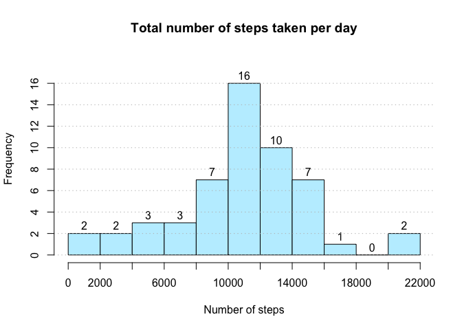
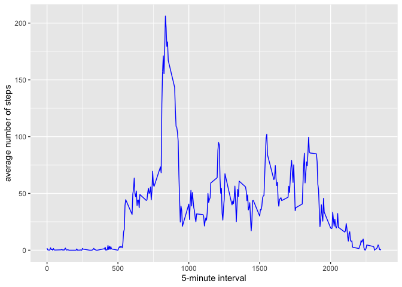
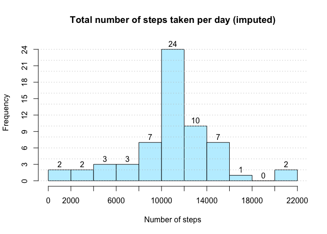
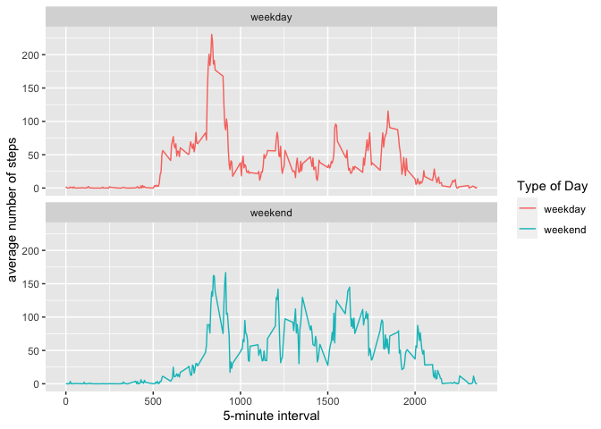

## Loading and preprocessing the data


```r
data <- read.csv("activity.csv")

data <- data %>%
  mutate(steps = as.numeric(steps),
         interval = as.numeric(interval),
         date = as.Date(date))
```

## What is mean total number of steps taken per day?

##### 1. Calculate the total number of steps taken per day

```r
steps_day <- data %>%
  filter(!is.na(data)) %>%
  group_by(date) %>%
  summarise(across(steps, sum, na.rm = TRUE))
steps_day
```

```
## # A tibble: 53 × 2
##    date       steps
##    <date>     <dbl>
##  1 2012-10-02   126
##  2 2012-10-03 11352
##  3 2012-10-04 12116
##  4 2012-10-05 13294
##  5 2012-10-06 15420
##  6 2012-10-07 11015
##  7 2012-10-09 12811
##  8 2012-10-10  9900
##  9 2012-10-11 10304
## 10 2012-10-12 17382
## # … with 43 more rows
```

##### 2. Make a histogram of the total number of steps taken each day

```r
hist(steps_day$steps,
     main = "Total number of steps taken per day",
     xlab = "Number of steps",
     col = "lightblue1",
     labels = T,
     breaks = seq(0,22000, by = 2000),
     xaxp = c(0, 22000, 11),
     ylim = c(0, 18),
     yaxp = c(0, 16, 8))

abline(h = seq(0, 16, 2), col = "gray", lty = "dotted")
```

<!-- -->

##### 3. Calculate and report the mean and median of the total number of steps taken per day

```r
steps_mean <- mean(steps_day$steps)
steps_median <- median(steps_day$steps)
steps_mean
```

```
## [1] 10766.19
```

```r
steps_median
```

```
## [1] 10765
```

## What is the average daily activity pattern?
##### 1. Make a time series plot

```r
steps_intv <- data %>% 
  group_by(interval) %>%
  summarise(steps = mean(steps, na.rm =TRUE))

ggplot(steps_intv,aes(interval, steps)) +
  geom_line(size = 0.5, col = "blue") +
  xlab("5-minute interval") +
  ylab("average number of steps")
```

<!-- -->

##### 2. Which 5-minute interval, on average across all the days in the dataset, contains the maximum number of steps?

```r
steps_intv %>%
  arrange(desc(steps)) %>%
  slice(1)
```

```
## # A tibble: 1 × 2
##   interval steps
##      <dbl> <dbl>
## 1      835  206.
```

## Imputing missing values

##### 1. Total number of missing values


```r
na <- !complete.cases(data)
sum(na == TRUE)
```

```
## [1] 2304
```

##### 2.-3. Imputing all of the missing values and create new dataset


```r
# Impute NA's with mean by interval
data.impute <- data %>%
  group_by(interval) %>%
  mutate(steps = ifelse(is.na(steps), mean(steps, na.rm = T), steps))
```

##### 4. Make a histogram of the total number of steps taken each day 


```r
steps_day_imp <- data.impute %>%
  group_by(date) %>%
  summarise(steps = sum(steps))
head(steps_day_imp)
```

```
## # A tibble: 6 × 2
##   date        steps
##   <date>      <dbl>
## 1 2012-10-01 10766.
## 2 2012-10-02   126 
## 3 2012-10-03 11352 
## 4 2012-10-04 12116 
## 5 2012-10-05 13294 
## 6 2012-10-06 15420
```

```r
hist(steps_day_imp$steps,
     main = "Total number of steps taken per day (imputed)",
     xlab = "Number of steps",
     col = "lightblue1",
     labels = T,
     breaks = seq(0,22000, by = 2000),
     xaxp = c(0, 22000, 11),
     ylim = c(0, 25),
     yaxp = c(0, 24, 8))

abline(h = seq(0, 24, 2), col = "gray", lty = "dotted")
```

<!-- -->

```r
# Calculate mean and median of imputed data
steps_imp_mean <- mean(steps_day_imp$steps)
steps_imp_median <- median(steps_day_imp$steps)

# Compare mean and median of imputed data with data excluding NA's
name <- c("mean","median")
steps_excl_na <- c(steps_mean, steps_median)
steps_imputed <- c(steps_imp_mean, steps_imp_median)

data.frame(name, steps_excl_na, steps_imputed)
```

```
##     name steps_excl_na steps_imputed
## 1   mean      10766.19      10766.19
## 2 median      10765.00      10766.19
```
###### Mean and median of imputed data are equal. Compared to data with with excluding NA's, just the medians slightly deviate, the means are equal.

## Are there differences in activity patterns between weekdays and weekends?


##### 1. Create new factor variable with "weekend" and "weekday"


```r
steps_intv_weektype <- data.impute %>%
  mutate(type_of_day = ifelse(weekdays(date) == "Samstag" | weekdays(date) == "Sonntag", "weekend", "weekday")) %>%
  group_by(interval, type_of_day) %>%
  summarise(steps = mean(steps, na.rm =TRUE))
```

```
## `summarise()` has grouped output by 'interval'. You can override using the `.groups` argument.
```

```r
steps_intv_weektype
```

```
## # A tibble: 576 × 3
## # Groups:   interval [288]
##    interval type_of_day   steps
##       <dbl> <chr>         <dbl>
##  1        0 weekday     2.25   
##  2        0 weekend     0.215  
##  3        5 weekday     0.445  
##  4        5 weekend     0.0425 
##  5       10 weekday     0.173  
##  6       10 weekend     0.0165 
##  7       15 weekday     0.198  
##  8       15 weekend     0.0189 
##  9       20 weekday     0.0990 
## 10       20 weekend     0.00943
## # … with 566 more rows
```

##### 2. Make a panel plot

```r
ggplot(steps_intv_weektype, aes(interval, steps, color = type_of_day)) +
  geom_line(size = 0.5) +
  scale_colour_discrete(name = "Type of Day") +
  xlab("5-minute interval") +
  ylab("average number of steps") +
  facet_wrap(~ type_of_day, ncol = 1, nrow = 2)
```

<!-- -->

